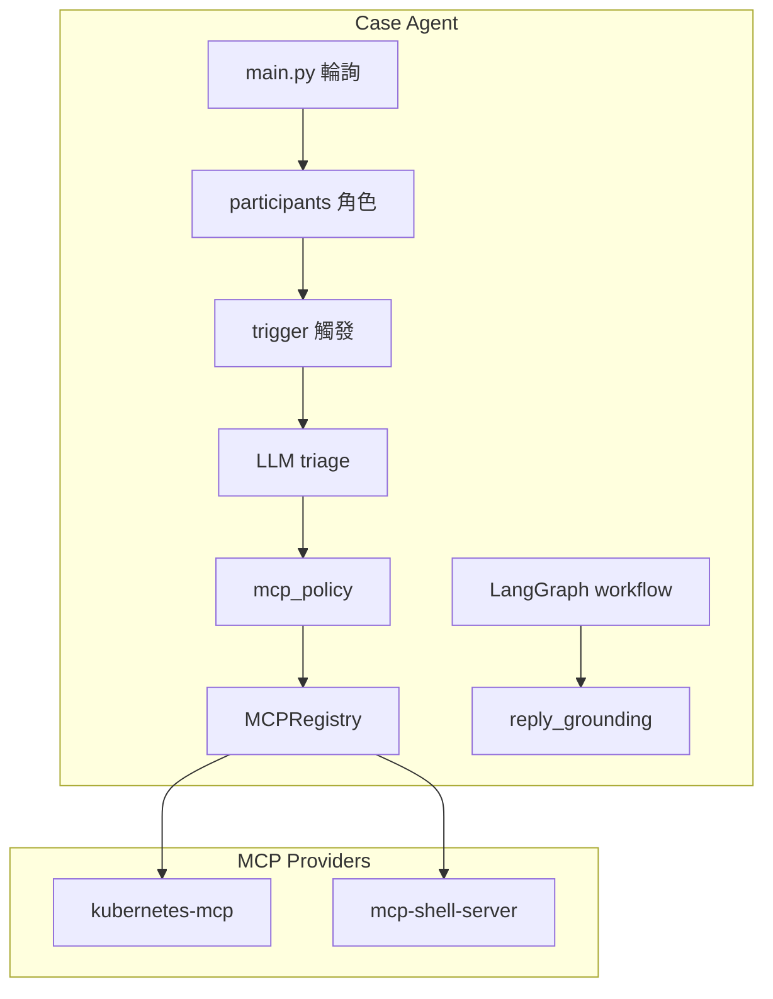
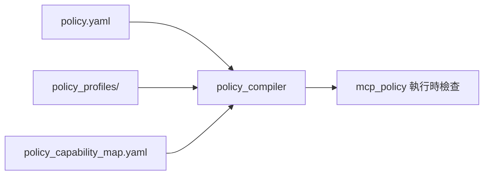

# AgentOps Case Agent — 開發者文件

客戶快速上手請看 [README.md](../README.md)。本文說明架構、觸發邏輯、Guardrail 與擴充方式。

---

## 設計原則

| 決策類型 | 負責方 | 範例 |
|----------|--------|------|
| **確定性規則** | Agent 程式 | 誰是 Support、要不要觸發、能否執行 MCP、出站安全 |
| **語意推理** | LLM | 理解留言、選工具、撰寫回覆 |
| **叢集 / Case 操作** | MCP Server | `oc` API、Case CRUD、must-gather、上傳 |

Agent **不在本機 subprocess 跑 shell**；本機 `dig`/`ping` 經可抽換的 **exec MCP**（`mcp-shell-server`）。

---

## 架構



### MCP Providers

| Provider | 用途 | 預設 / 覆寫 |
|----------|------|------------|
| `platform` | Case 讀寫、K8s API | 預設 `npx -y rh-tam-kubernetes-mcp-server@latest`；覆寫：`config/local.json`、`MCP_PLATFORM_COMMAND`、PATH binary |
| `exec` | 本機 dig/ping 等 | 預設同 venv 的 `mcp-shell-server`（`pip install`）；覆寫：`MCP_EXEC_COMMAND`、PATH |

路由：純網路診斷 shell（dig/ping/nslookup…）→ 確定性路由；有 `diagnostics.pods_exec` 時優先 `pods_exec`，否則 `exec_argv`。見 [docs/POLICY.md](POLICY.md)、`core/shell_diagnostics.py`。

---

## 設定載入順序

```
程式內建 default_config()
  → config/agent_config.json   （客戶：case_id + llm）
  → config/local.json          （本機 MCP 路徑，gitignore）
  → 環境變數 (.env / CASE_ID / LLM_* / MCP_*)
  → MCP auto-discovery         （npx platform 預設 + PATH/venv exec）
```

| 環境變數 | 用途 |
|----------|------|
| `GEMINI_API_KEY` / `OPENAI_API_KEY` | LLM |
| `CASE_ID` | 覆寫 case 編號 |
| `LLM_PROVIDER` / `LLM_MODEL` | 覆寫 LLM |
| `MCP_PLATFORM_COMMAND` | kubernetes-mcp 路徑 |
| `MCP_EXEC_COMMAND` | mcp-shell-server 路徑 |
| `AGENT_DEV_MODE=1` | 啟用 demo 測試模式（見下） |

完整參數表（含輪詢、`participants`、`trigger` 範例）見 [README.md — 可調整設定](../README.md#可調整設定依檔案)。

---

## 觸發與角色（L1 + L2）

### 預設行為（客戶 / production）

無需設定 `trigger` 區塊。預設：

- `trigger.mode = production`
- 只處理 **Support** 留言（`createdByType` API 優先，fallback `*@redhat.com`）
- 略過 Customer 內部討論
- 跳過 Agent 自己的回覆（`【AI 運維代理自動通知】` 前綴）

### 開發測試（demo）

在 **`.env`** 設 `AGENT_DEV_MODE=1`，或在 **`config/agent_config.json`** 設 `"trigger": { "mode": "demo" }`。

| 機制 | 設定位置 | 說明 |
|------|----------|------|
| `trigger.mode` | `config/agent_config.json` → `trigger.mode` | 設了 `AGENT_DEV_MODE=1` 且未指定時自動為 `demo` |
| `[SE] ` 前綴 | `config/agent_config.json` → `participants.demo_trigger_prefix` | 留言以此開頭 → 視為 Support（僅 dev mode） |
| Customer 明確請求 | `config/agent_config.json` → `trigger.require_explicit_request_in_demo` | code block、「請執行」等也可觸發 |

### L1：ParticipantResolver（`core/participants.py`）

辨識順序：

1. Agent 回覆前綴 → `agent`
2.（dev only）`demo_trigger_prefix` → `support`
3. API `createdByType` / `api_role`
4. `ignore_authors`、`support_author_patterns` 等
5. Fallback → `customer`

### L2：TriggerConfig（`core/trigger.py`）

從最新留言往回掃 `find_latest_unanswered_trigger_comment`：

- 最新是 Agent 回覆 → 不觸發
- production + customer → 略過
- 符合 Support 請求 → LLM triage

---

## Workflow（`workflow/graph.py`）

**目標心智模型**：Guardrailed ReAct（見 [note.md](../note.md#核心心智模型guardrailed-react)）——Reason → Act → Observe → 再 Reason，不是傳聲筒。

**現況（Phase 3，單輪內 Guardrailed ReAct investigate loop）**：

```
analyze → policy → [execute | compose]
execute → interpret ⇄ investigate_prepare → policy → execute → …
interpret → collection → bundle → convergence → compose → post
```

`investigation.enabled`（預設 true）與 `max_follow_up_steps`（預設 2）見 `config/agent_config.json`。

`main.py` 在進 workflow 前已完成 LLM triage（含 author / trigger metadata），並設定 `analysis_prefilled=True`；workflow 的 `analyze` 節點會 skip，避免重複 LLM 呼叫。

| 節點 | ReAct 角色 | 職責 |
|------|------------|------|
| `analyze` | **Reason** | 理解 SE 留言、規劃 MCP / clarify |
| `policy` | **Guardrail** | 能不能 act（LLM 不決定） |
| `execute` | **Act** | MCP 呼叫 |
| `interpret` | **Observe → Reason** | 綜合 MCP 輸出、next_steps、假設 |
| `convergence` | **Reason** | 是否收斂 |
| `compose` | **Reply** | 帶判斷寫回 Case（須 grounding） |
| `post` | **Guardrail** | 出站掃描 + 防偽 |

PoC 量測與 SRE run 報告見 `core/poc_metrics.py`、`core/run_report.py`；CLI：`python main.py --report`。

上傳閉環見 `core/collection_flow.py`（must-gather → upload → `list_case_attachments` 驗證）。clarify 模板見 `config/clarify_templates.yaml`。

| 節點 | 職責 |
|------|------|
| `policy` | `policy.yaml` 編譯結果：能力開關、工具白/黑名單、exec binary 白名單 |
| `execute` | MCP 呼叫（dry-run 時跳過實際執行） |
| `interpret` / `convergence` | LLM 解讀與收斂 |
| `compose` | LLM 撰寫回覆（綜合 interpret，非 relay raw output） |
| `post` | 出站 guardrail + **回覆防偽** + `add_case_comment` |

`policy` 短路：`call_mcp` 被擋 → 直接 `compose`（不浪費 interpret LLM）。

### action_type

| 值 | 行為 |
|----|------|
| `call_mcp` | 執行 MCP 並回覆 |
| `reply_only` / `clarify` | 僅文字 |
| `dangerous_command` | 攔截說明 |
| `no_action` | 略過 |

---

## 三層觸發 + 五層 Guardrail

對外敘事（見 [note.md](../note.md)）使用 **L0–L5 五層 Guardrail**。開發者文件在此對照模組：

| 層 | 模組 | 內容 |
|----|------|------|
| L0 | `trigger` + `participants` | 誰的留言、是否該處理 |
| L1 | `mcp_policy`（dangerous keywords） | 入站 / 出站危險關鍵字 |
| L2 | `policy.yaml` / `mcp_policy` | 能力包、工具白黑名單 |
| L3 | `shell_diagnostics` + `comment_analyzer` | 確定性路由；無映射 → clarify |
| L4 | Exec MCP（`exec_argv`） | argv 陣列白名單 |
| L5 | `reply_guardrail` + `reply_grounding` | 回覆防偽、出站掃描 |

> 舊版「三層」指 participants / trigger / policy+reply，已併入上表 L0–L5，避免與 note.md 不一致。

### MCP Policy（`config/policy.yaml`）

使用者只編輯 **`config/policy.yaml`**，選 `profile`（`minimal` / `diagnostic` / `enterprise`）與可選 `mode`（`denylist` / `allowlist`）。

編譯流程（`core/policy_compiler.py`）：



| 概念 | 說明 |
|------|------|
| Profile | 能力包預設（讀 Case、查叢集、跑診斷…） |
| Mode | `denylist` 預設允許已開能力；`allowlist` 只允許已開能力 |
| Exec binaries | dig/ping/nslookup… 的 argv 白名單（非逐條 shell 列舉） |
| `dangerous_commands` | 留言 / argv 危險關鍵字補洞 |

完整說明：[POLICY.md](POLICY.md)

### 回覆防偽（`core/reply_grounding.py`）

`call_mcp` 後若 LLM 回覆含偽造的 dig/DNS 成功輸出，但 `execution_results` 為失敗 → 擋下並改用 **原始 MCP 輸出** fallback。

開關：`guardrails.reply.block_ungrounded_execution_output`（預設 true）。

### Shell 診斷路由

- `is_shell_only_request` → 確定性 `exec_argv`（`source=route`），不讓 LLM 選 `namespaces_list`
- LLM 選錯工具時 → `shell_diag_routing_override`

---

## 防無窮迴圈

| 機制 | 設定 |
|------|------|
| Cooldown | `polling.cooldown_after_reply_seconds`（45） |
| Session 上限 | `limits.max_replies_per_session`（20） |
| Loop guard | `agent.loop_guard_seconds`（1800） |
| 去重 | `processed_handled_keys`（timestamp + hash） |

---

## 專案結構

```
├── main.py                 # CLI：run / --check / --dry-run
├── config/
│   ├── agent_config.json       # 客戶設定（精簡）
│   ├── agent_config.minimal.json
│   ├── local.json              # 本機 MCP（gitignore）
│   ├── policy.yaml
│   ├── policy_profiles/
│   ├── policy_capability_map.yaml
│   └── prompts/
├── bridges/
│   ├── mcp_bridge.py
│   ├── mcp_registry.py         # 多 provider 路由
│   └── case_portal.py
├── core/
│   ├── config.py               # 分層載入
│   ├── mcp_discovery.py
│   ├── setup_check.py
│   ├── dev_mode.py
│   ├── comment_analyzer.py
│   ├── reply_grounding.py
│   └── ...
├── workflow/graph.py
├── docs/
│   ├── DEVELOPER.md            # 本文件
│   ├── mcp_case_api_integration.md
│   └── mcp_exec_contract.md
└── tests/
```

---

## 日誌

JSON 一行一筆到 stdout。常見 `event`：

| event | 意義 |
|-------|------|
| `trigger_candidate` | 找到待處理 Support 留言 |
| `comment_analyzed` | LLM / 確定性 triage 完成 |
| `shell_diag_deterministic_route` | dig/ping 走 exec_argv |
| `mcp_call` | MCP 執行（含 `provider`、`actual_tool`） |
| `reply_grounding_fallback` | 防偽擋下，改貼原始輸出 |
| `reply_guardrail_blocked` | 出站被擋 |
| `case_comment_added` | 回覆成功 |

---

## 測試

```bash
python3 -m unittest discover -s tests -v
python main.py --check
```

---

## 擴充指南

| 目標 | 檔案 |
|------|------|
| 調整 triage 提示詞 | `config/prompts/analyze_comment.txt` |
| 調整回覆語氣 | `config/prompts/compose_reply.txt` |
| 調整結果解讀 | `config/prompts/interpret_results.txt` |
| 調整收斂判斷 | `config/prompts/assess_convergence.txt` |
| 新增 MCP 政策 | `config/policy.yaml` + `config/policy_capability_map.yaml` |
| 新增 workflow 步驟 | `workflow/graph.py` |
| 更換 exec 層 | `config/local.json` → `mcp_providers.exec` |
| 修改產品預設值 | `core/config.py` → `default_config()` |
| Outage 自動開案 | 尚未實作；見 README 討論的 intake playbook |

使用者可調項目（輪詢、角色、測試模式等）統一寫在 [README.md — 可調整設定](../README.md#可調整設定依檔案)。

---

## 安全與機敏資料

| 層級 | 機制 |
|------|------|
| **出站回覆** | `ReplyGuardrail` 攔截 API key、Bearer、私鑰等模式 |
| **日誌 / Audit** | `core/redaction.py` → `sanitize_for_log` |
| **持久化** | `reports/`、`agent_memory.json`、`approvals.json` 寫入前經 `sanitize_for_storage` |
| **Git** | `.env`、`agent_memory.json`、`reports/`、`config/local.json` 已列入 `.gitignore` |

測試請一律使用 `tests/safe_test_data.py` 的合成資料（`example.test` 信箱、假 case ID、假 API key），勿嵌入真實 Case 編號、客戶內容或憑證。

---

## MCP 工具參考

`python check_mcp_tools.py` 列出完整清單。常用：

| 工具 | 用途 |
|------|------|
| `read_case_comments_rh_portal` | 讀留言 |
| `add_case_comment_rh_portal` | 發回覆 |
| `upload_attachment_rh_portal` | 上傳 must-gather 等 |
| `oc_adm_must_gather` | 收集 must-gather |
| `resources_list` / `pods_log` | K8s 診斷 |
| `pods_exec` | Pod 內 dig/ping |
| `shell_execute`（exec MCP） | 本機 dig/ping |

`create_case_rh_portal` 目前被 policy 封鎖；outage 開案需另做 intake 流程。

---

## 常見開發問題

**comment_skipped reason**

| reason | 意義 |
|--------|------|
| `customer_internal` | production 略過 customer 留言 |
| `customer_no_explicit_request` | demo 模式下 customer 閒聊 |
| `loop_guard_same_request_blocker` | 相同失敗指令冷卻中 |
| `no_mcp_actions` | 無法映射到 MCP |

**Hydra JSON**  
MCP 回傳結構化 JSON 時日誌出現 `comments_parsed_api_json`。規格見 [mcp_case_api_integration.md](mcp_case_api_integration.md)。

**Legacy**  
根目錄 `agent_config.json` 僅舊版 MCP OAuth；使用者設定請用 `config/agent_config.json`。
