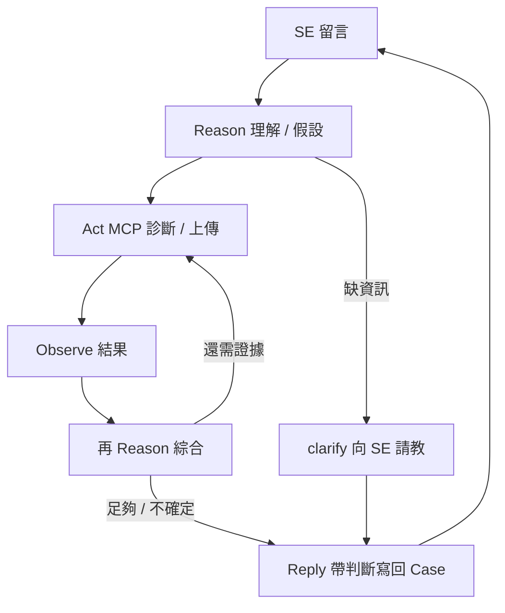

# Case Agent — 電梯簡報

> 約 5 分鐘 · 10 張 · 對內 / 對客戶 PoC 提案用

---

## Slide 1 — 標題

# Case Agent

**Guardrail-first 的 Enterprise Support 協作助手**

與 Red Hat Support Engineer 一起，在 Case 上排查、收斂、解決問題。

---

## Slide 2 — 問題

### Outage 時，Support Case 來回很慢

- SE 留言：「請跑 `oc get node`、上傳 must-gather」
- 客戶 SRE 正在救火，**漏跑、晚回、格式不對** → 又多一輪來回
- 若用「全自動 AI」碰 production：**沒 Guardrail = 不可接受**

> 我們需要的不是更聰明的 chatbot，而是 **敢在 Enterprise 環境裡幫忙的人**。

---

## Slide 3 — 我們是誰

### Case Agent = 營運團隊的小幫手（Guardrailed ReAct）

| | |
|--|--|
| **和誰協作** | 人類 SRE + Red Hat Support Engineer |
| **在哪協作** | Support Case（留言、附件） |
| **做什麼** | **Reason → Act → Observe** 排查：理解 SE 指示、執行診斷、綜合結果、提出下一步 |
| **不做什么** | 取代 SRE、自動結案、無邊界自主操作、**當傳聲筒貼 raw output** |

**一句話**：Outage 時跟原廠工程師一起**推理、縮小、收斂** Solution——不是指令轉發器。

---

## Slide 4 — 怎麼運作（Guardrailed ReAct）



- **Reason**：讀 Case、理解 SE 要查什麼、呼應其假設
- **Act**：能跑且 policy 放行 → MCP；危險指令 → 擋下並請替代方案
- **Observe → 再 Reason**：綜合輸出，決定要不要再查或請 SE 補資訊
- **Reply**：帶**發現與建議**，不是 raw log 轉貼
- **單輪內 ReAct**：interpret 後可自動再查（`max_follow_up_steps`，預設 2），每步仍過 policy

**成功 = 協作收斂**，不是「全自動結案」，也不是「傳聲筒」。

---

## Slide 5 — 為什麼 Enterprise 敢用

### Guardrail-first：五層防護

```
L0 觸發規則 → L1 危險關鍵字 → L2 policy 能力包
→ L3 確定性路由 → L4 MCP argv 白名單 → L5 回覆防偽
```

| 原則 | 說明 |
|------|------|
| **LLM 不做閘門** | 能不能跑，由確定性規則決定 |
| **能力包，非逐條 shell** | `diagnostic` / `enterprise` profile 一鍵切換 |
| **回覆可稽核** | 禁止捏造輸出；對應真實執行結果 |

> 客戶敢讓 Agent 碰環境，是因為 **有邊界**，不是因為它很聰明。

---

## Slide 6 — 和 Cursor 不一樣（不必對標）

| | **Case Agent** | Cursor / Coding Agent |
|--|----------------|----------------------|
| 場景 | Support Case 協作 | IDE 寫 code |
| 對象 | 原廠 SE | 開發者自己 |
| 產出 | 可稽核的 Case 回覆 | Patch / commit |
| 安全 | 多層 Guardrail + policy | 使用者自負 |

**三關鍵字**：Case-native · Guardrail-first · Vendor 協作

---

## Slide 7 — 現在能做什麼

✅ 輪詢 Case、辨識 SE 請求  
✅ `oc get`、Pod log、dig/ping（經 MCP）  
✅ 危險指令攔截 + 結構化回覆  
✅ 不確定時 clarify 向 SE 請教  
✅ dry-run 試跑、policy 審計  
✅ PoC 量測（`--report`）與 run 報告（`reports/`）  
✅ must-gather / 上傳閉環（收集→上傳→附件清單驗證）  
✅ clarify 模板（`config/clarify_templates.yaml`）  

🔲 SRE dashboard（目前為 CLI 報告）  
🔲 多產品 MCP（RHEL、Ansible…）

**架構**：Agent 薄（workflow + 安全）· MCP 厚（執行能力可掛載）

---

## Slide 8 — PoC 怎麼算成功

| 指標 | 我們要證明什麼 |
|------|----------------|
| **回應時效** | SE 要求後，更快有結構化回覆 |
| **來回次數** | 減少「請再跑一次」的來回 |
| **漏跑率** | 降低人為漏跑診斷 |
| **安全可理解** | 被擋時 SE 能給替代步驟 |

❌ 成功 ≠ 自動結案  
✅ 成功 = **受控協作**能縮短排查時間

---

## Slide 9 — 路線圖

### Phase 1 — PoC（現在）
- 1～2 個真實 Case 驗證
- 量測 baseline vs PoC 後指標
- 最小 SRE 可見性（run log）

### Phase 2 — Enterprise
- 稽核 trail、Outage webhook、人工核准
- `--health`、Secrets 檔案注入、tenant 標記
- 詳見 [docs/ENTERPRISE.md](docs/ENTERPRISE.md)

---

## Slide 10 — 下一步

### 建議 PoC 範圍

1. 選 **1 個進行中的 OpenShift Case**（已有 SE 互動）
2. 部署 Case Agent（`diagnostic` profile + dry-run 試跑）
3. 跑 **2 週**，量測回應時效與來回次數
4. 與 SE 訪談：回覆品質、clarify 是否有幫助

### 我們提供
- Agent 部署與 policy 設定
- PoC 量測模板
- Guardrail 審計報告（`--policy-dump`）

---

*Case Agent · Case-native · Guardrail-first · Vendor 協作*
