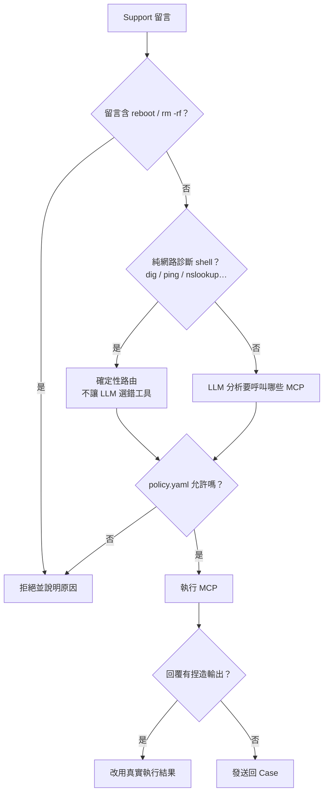
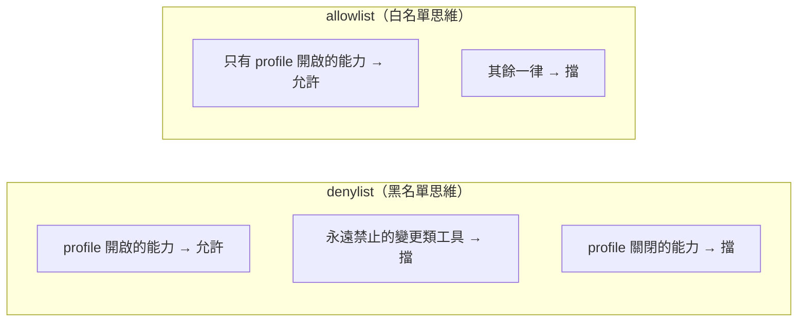
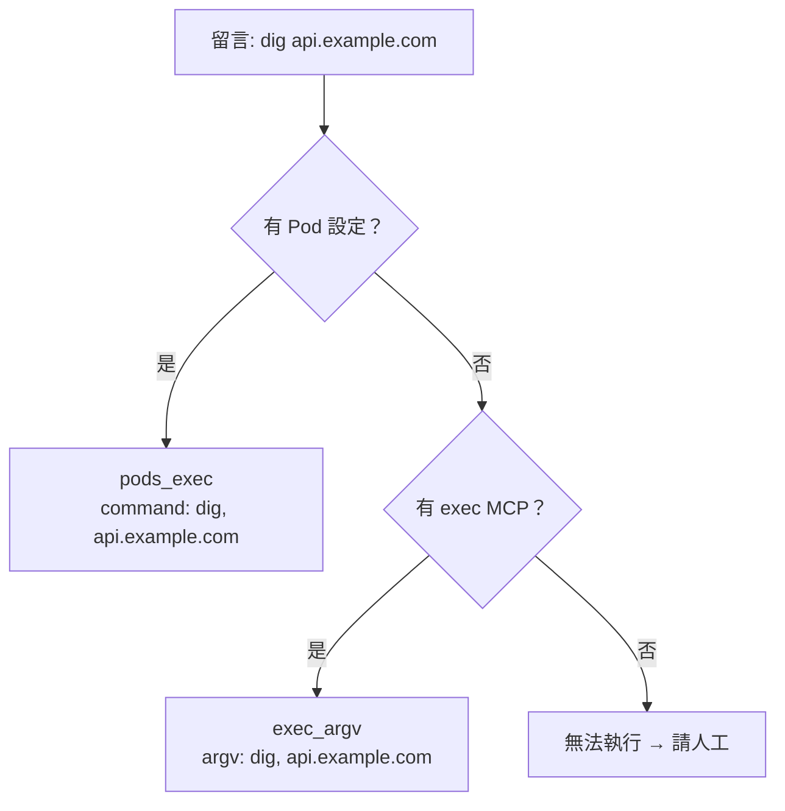

# 安全政策說明

Agent 的「能不能執行」由**確定性規則**決定，不由 LLM 決定。  
您只需要編輯 **`config/policy.yaml`** 一個檔案。

---

## 30 秒快速開始

```yaml
# config/policy.yaml
profile: diagnostic   # minimal | diagnostic | enterprise
```

```bash
python main.py --check        # 看生效摘要
python main.py --policy-dump  # 看完整編譯結果（給資安審計）
```

| Profile | 適合誰 | 一句話 |
|---------|--------|--------|
| `minimal` | 只想自動回覆、不碰叢集 | 只讀寫 Case |
| `diagnostic` | **預設 / PoC** | 診斷：查叢集 + 網路診斷 shell |
| `enterprise` | 生產環境 | 白名單：只開明確允許的能力 |

---

## 一張圖看懂全流程

Support 留言進來後，Agent 依序檢查：



**您要管的主要是 F 這一步**——透過 `policy.yaml` 選 profile 與能力開關。

---

## 您只需要理解兩個概念

### 1. Profile = 能力包（做哪幾類事）

不是列舉每一條 shell 指令，而是開關「能力」：

| 能力 | 白話 | 典型 MCP |
|------|------|----------|
| `case_read` | 讀 Case / 留言 | `read_case_comments_rh_portal` |
| `case_write` | 發回覆 | `add_case_comment_rh_portal` |
| `case_create` | 開新 Case | `create_case_rh_portal`（預設關） |
| `cluster_read` | 叢集唯讀查詢 | `resources_list`, `pods_log`… |
| `cluster_exec` | 叢集內跑診斷指令 | `pods_exec` |
| `host_diag` | 本機 / 跳板機網路診斷 | `exec_argv` |
| `must_gather` | 收集 must-gather | `oc_adm_must_gather` |
| `upload_attachments` | 上傳附件 | `upload_attachment_rh_portal` |

能力與工具的對照在 `config/policy_capability_map.yaml`（產品內建，一般不改）。

### 2. Mode = 預設開還是預設關



| Mode | 心智模型 | 建議場景 |
|------|----------|----------|
| `denylist` | 預設允許已開能力，只擋危險項 | PoC、`diagnostic` profile |
| `allowlist` | 只允許明確列出的工具 | 生產、`enterprise` profile |

**同一套設定，不再混用「工具黑名單 + 指令白名單」兩種反向邏輯**——您先選 mode，系統自動編譯成執行規則。

---

## 確定性路由（不是只有 dig/ping）

文件常舉 `dig` / `ping` 為例，程式實際支援這一整類**網路診斷 shell**：

`nslookup` · `ping` · `dig` · `host` · `traceroute` · `curl`

當留言**只有**這類指令（沒有 `oc get` 等叢集查詢）時：

1. **不經 LLM 選工具**（避免選成 `namespaces_list`）
2. 自動轉成 MCP 動作：
   - 有設定 `diagnostics.pods_exec` → **`pods_exec`**（在叢集 Pod 內執行）
   - 否則且有 exec MCP → **`exec_argv`**（在本機 / 跳板機執行）



`oc get node` 等叢集唯讀查詢 → **確定性路由**到 `resources_list` / `pods_list`（不依賴 LLM）；其餘交給 LLM 或 clarify。

---

## 設定範例

### 預設（大多數人不用改）

```yaml
profile: diagnostic
```

### 關閉本機 dig/ping，只允許叢集內執行

```yaml
profile: diagnostic
capabilities:
  host_diag: false
  cluster_exec: true
```

### 生產環境（嚴格白名單）

```yaml
profile: enterprise
mode: allowlist
```

### 進階微調（少數情境）

```yaml
profile: diagnostic
overrides:
  block_tools: [upload_attachment_rh_portal]
  upload_path_prefixes: ["/tmp/", "./must-gather/"]
  exec_binaries: [dig, ping, curl]
  dangerous_commands: ["chmod 777"]
```

---

## 檔案說明

| 檔案 | 誰編輯 | 用途 |
|------|--------|------|
| **`config/policy.yaml`** | **您** | 唯一入口：選 profile / mode / 覆寫能力 |
| `config/policy_profiles/*.yaml` | 產品內建 | 三種範本（minimal / diagnostic / enterprise） |
| `config/policy_capability_map.yaml` | MCP 擴充時 | 能力 ↔ 工具對照 |

---

## 與其他設定的關係

| 設定 | 管什麼 |
|------|--------|
| `config/policy.yaml` | **能不能執行**（MCP / shell） |
| `config/agent_config.json` | Case ID、輪詢、**pods_exec 目標 Pod** |
| `guardrails` in config | 回覆防偽、敏感資訊過濾 |
| exec MCP 本身 | 只收 argv 陣列、timeout 上限（硬底線） |

---

## 混合指令（危險 + 安全）

Support 常一次貼多條指令，例如：

```
請執行
reboot
oc get pod -A
oc get nodes
```

預設 `dangerous_handling: skip_and_continue` 行為：

| 指令 | 結果 |
|------|------|
| `reboot` | 跳過，寫入回覆說明 |
| `oc get pod -A` | 執行 MCP，回覆真實輸出 |
| `oc get nodes` | 執行 MCP，回覆真實輸出 |

若改為 `dangerous_handling: reject_all`，留言含危險指令時**整則**不執行（舊行為）。

---

## 診斷輸出：留言為主，附件為輔

| 類型 | 典型請求 | 行為 |
|------|----------|------|
| 執行指令 / oc get / dig | 多數 Support 留言 | **結果寫在 Case 留言** |
| 輸出過長 | 少見 | 可設 `bundle_output.mode: overflow_only` → 自動 spill 附件 |
| 明確上傳檔案 | 「請把 /path/x 上傳」 | LLM 規劃 `upload_attachment_rh_portal`（或產品 MCP） |
| must-gather / sosreport | 尚無專用 MCP | **向 Support 協作請教**步驟與路徑；有 MCP 時再執行 |

可選設定（預設 **不**自動打包）：

```json
"diagnostics": {
  "bundle_output": {
    "mode": "off",
    "filename": "auto",
    "directory": "diag-output",
    "overflow_chars": 3500
  }
}
```

- `mode: off` — 全部進留言（預設）  
- `mode: overflow_only` — 僅當輸出超過 `overflow_chars` 才寫附件（檔名自動產生，非固定 `debug.txt`）  

### 沒有 sosreport / must-gather MCP 時

**這是正常路徑，不是缺陷。** Agent 應在 Case 上向 Support 確認：執行位置、完整指令、產物路徑、是否需上傳附件。Support 回覆明確步驟後再繼續 — 與「自動跑完」同等重要。

---

## 常見問題

**Q: 要逐條列出所有危險指令嗎？**  
不必。主防線是 **能力白名單 + exec 只允許固定 binary**；`dangerous_commands` 只擋留言裡明顯的破壞性關鍵字（reboot、rm -rf…）。

**Q: 新掛上的 MCP 工具會自動能跑嗎？**  
- `denylist` + `diagnostic`：會（除非屬於關閉的能力或永遠禁止清單）  
- `allowlist` + `enterprise`：**不會**，需更新 capability map 或 overrides

**Q: 怎麼確認生效？**  
`python main.py --check` 會印 Policy 摘要；`--policy-dump` 輸出完整 JSON 供審計。

---

## 開發者

編譯邏輯：`core/policy_compiler.py`  
執行檢查：`core/mcp_policy.py`  
單元測試：`tests/test_policy_compiler.py`
