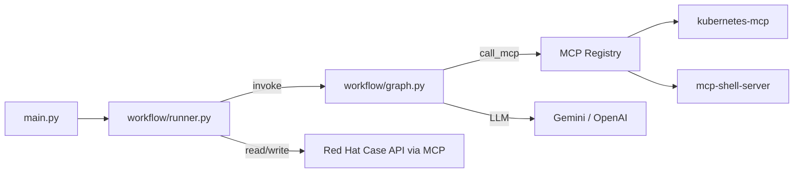

# Module Map

| | |
|---|---|
| **Purpose** | 說明每個程式碼模組「擁有什麼」— 架構責任與程式目錄的對照 |
| **Audience** | 新貢獻者、架構師、除錯中的開發者 |
| **Source of truth** | 本文件是**模組責任**的權威來源；概念架構見 [02-reference-architecture.md](02-reference-architecture.md) |
| **Related** | [05-vocabulary.md](05-vocabulary.md)、[guides/developer.md](../guides/developer.md)、[operations/constraints.md](../operations/constraints.md) |

> 本文件描述**架構責任**，不深入實作細節。實作行為見 [guides/developer.md](../guides/developer.md)。

---

## 五分鐘導覽

這個 repository 是 **Enterprise AI Agent Reference** 的第一個參考實作：**Case Agent**（自動協助 Red Hat Support Case）。

一次輪詢週期的高層流程：

```
main.py 啟動 poll loop、組裝 runtime
  → workflow/runner.py 單次 poll 編排（經 Connector 取事件）
       → 讀取 Case 留言、角色辨識（participants）與觸發（trigger）
       → Understanding 理解留言（core/understanding/）
       → workflow/graph.py 協調執行
            → Decision Engine 政策檢查（decision_engine）→ MCP 執行（mcp_registry）
            → 解讀結果 → 撰寫回覆 → 出站安全 → 發回 Case
```

**三層責任分工**（改碼前先記住）：

| 負責方 | 做什麼 |
|--------|--------|
| **Agent 程式** | 觸發規則、政策、guardrail、防偽、審計 |
| **LLM** | 理解留言、解讀結果、撰寫回覆 |
| **MCP Server** | 叢集操作、Case API、本機 shell 診斷 |

---

## 對照參考架構

文件定義五個核心元件。下表說明它們在**現有程式**中的對應位置（概念對齊，非一對一模組）：

| 參考架構元件 | 現有模組（主要） | 對齊狀態 |
|--------------|------------------|----------|
| **Workflow Engine** | `workflow/runner.py`、`workflow/graph.py` | **已對齊（Sprint 1）** — runner 負責 poll 編排；graph 定義狀態機 |
| **Understanding** | `core/understanding/`、`participants`、`trigger`、`result_interpreter`、`collaboration_reasoner` | **已對齊（Sprint 2）** — `UnderstandingService` 單一入口；語意與 routing 分離 |
| **Decision Engine** | `core/decision/`、`mcp_policy`、`approval` | **已對齊（Sprint 3）** — `DecisionEngine` 單一入口；workflow `policy` / 核准閘門經此元件 |
| **Tool Provider** | `bridges/mcp_*`、`core/mcp_action`、routing helpers | 較好 — MCP 抽象已成形 |
| **Response** | `reply_composer`、`reply_guardrail`、`reply_grounding`、`case_portal` | 分散 — 無單一模組邊界 |
| **Connector（事件來源）** | `connectors/`、`bridges/case_portal.py` | **已對齊（Sprint 4）** — `Connector` 介面 + `CasePortalConnector` 實作 |

---

## 頂層目錄

### `main.py`

| | |
|---|---|
| **Purpose** | 應用程式 CLI 入口與 runtime 啟動 |
| **Responsibility** | CLI 參數解析；載入設定；處理 `--check` / `--report` 等一次性指令；組裝 MCP / WorkflowDeps；啟動 poll loop；KeyboardInterrupt 時保存 memory |
| **Main dependencies** | `bridges/`、`workflow/`、`core/`（設定、memory、setup） |
| **Key files** | `main.py` |
| **Future evolution** | runtime bootstrap 可能移出（見 Architecture Debt）；Connector 抽象後 poll 驅動可能改由 Connector 介面 |

> **職責備註（Sprint 1 後）：** `main.py` 不再包含單次 poll 編排；該邏輯在 `workflow/runner.py`。

---

### `workflow/`

| | |
|---|---|
| **Purpose** | Workflow Engine — poll 編排與 LangGraph 狀態機 |
| **Responsibility** | `runner.py`：單次 poll 週期（讀留言、triage、invoke workflow、持久化 memory）；`graph.py`：定義狀態機，依序呼叫理解、政策、執行、解讀、收斂、撰寫、發送回覆；管理單輪內 investigate loop |
| **Main dependencies** | `bridges/case_portal`、`core/` 中 understanding、policy、executor、composer、guardrail、memory 等 |
| **Key files** | `runner.py`（`process_poll_cycle`）、`graph.py`（`AgentState`、`WorkflowDeps`、`build_workflow`） |
| **Future evolution** | 領域專屬步驟（collection、bundle、investigation）可能移出，使 graph 專注編排 |

#### `workflow/runner.py`

| | |
|---|---|
| **Purpose** | Workflow Engine runtime — 單次 poll 週期編排 |
| **Responsibility** | cooldown / session 限制檢查；讀取並 enrich 留言；觸發與 triage；組裝 workflow state 並 `app.invoke`；run report、webhook、memory 持久化；poll 間隔 sleep |
| **Main dependencies** | `connectors/`、`workflow/graph`、`core/`（comments、trigger、memory、audit 等） |
| **Key files** | `runner.py` |
| **Future evolution** | 領域步驟可能移出，使 graph 專注編排（Sprint 5） |

---

### `connectors/`

| | |
|---|---|
| **Purpose** | Connector 抽象 — 營運系統對話邊界（事件進、回覆出） |
| **Responsibility** | 定義 `Connector` 協定；提供產品專屬實作（目前為 Red Hat Case Portal） |
| **Main dependencies** | `bridges/case_portal`（MCP 實作細節） |
| **Key files** | `base.py`（`Connector` Protocol）、`case_portal.py`（`CasePortalConnector`） |
| **Future evolution** | 未來可新增 Jira / ServiceNow 實作，不修改 Workflow Engine |

**Runtime 呼叫：** `workflow/runner.py` → `connector.poll_events()`；`workflow/graph.py` `post` → `connector.send_response()`。

> **與 Tool Provider 的邊界：** Connector 負責「與營運系統對話」（讀留言、發回覆）；MCP Registry 負責「執行操作」（oc、shell、must-gather）。Case Portal MCP 是 Connector 實作的內部細節。

---

### `bridges/`

| | |
|---|---|
| **Purpose** | 對外系統的整合層（Connector + Tool Provider 的實作落點） |
| **Responsibility** | 抽象 MCP 程序通訊；路由多 MCP provider；封裝 Red Hat Case Portal 讀寫 |
| **Main dependencies** | `core/config`、`core/case_api_models`、`core/comments` |
| **Key files** | 見下方子模組 |
| **Future evolution** | `case_portal` 可能演進為通用 Connector 介面的一個實作 |

#### `bridges/mcp_bridge.py`

| | |
|---|---|
| **Purpose** | 單一 MCP Server 程序的 JSON-RPC 通訊 |
| **Responsibility** | 啟動 subprocess；initialize；`call_tool` / `list_tools` |
| **Main dependencies** | `core/logging` |
| **Key files** | `mcp_bridge.py` |

#### `bridges/mcp_registry.py`

| | |
|---|---|
| **Purpose** | Tool Provider 路由層 |
| **Responsibility** | 依設定註冊多個 MCP provider；將 logical tool 名稱路由到正確 provider；支援 `tool_map` 別名 |
| **Main dependencies** | `mcp_bridge.py`、`core/config` |
| **Key files** | `mcp_registry.py` |

#### `bridges/case_portal.py`

| | |
|---|---|
| **Purpose** | Red Hat Case Portal MCP 適配器 |
| **Responsibility** | 經 MCP 讀寫 Case 留言、詳情、附件；由 `CasePortalConnector` 封裝對外暴露 |
| **Main dependencies** | `mcp_bridge`（經 registry）、`core/case_api_models`、`core/comments` |
| **Key files** | `case_portal.py` |

---

### `core/`

業務邏輯主目錄。以下依**架構職責**分組，而非檔名字母排序。

---

#### 理解（Understanding）

負責解讀外部輸入、辨識意圖與脈絡。**不應**做最終執行許可決策。

| 模組 | Purpose | Responsibility | Main dependencies |
|------|---------|----------------|-----------------|
| `understanding/service.py` | Understanding 單一入口 | `UnderstandingService.analyze()` — policy precheck、action inference、semantic understanding 編排 | `action_inference`、`semantic`、`mcp_policy` |
| `understanding/semantic.py` | 語意理解 | LLM triage、無 LLM fallback、clarify 豐富化 | `llm_client`、`action_inference` |
| `understanding/action_inference.py` | 確定性 action 推斷 | shell / cluster read / collection 路由（產出建議動作，非許可） | `shell_diagnostics`、`cluster_read_routing`、`collection_flow` |
| `understanding/models.py` | 理解資料模型 | `CommentAnalysis`、`VALID_ACTION_TYPES` | `mcp_action` |
| `comment_analyzer.py` | 向後相容 facade | 委派至 `UnderstandingService`；保留既有 import 路徑 | `understanding/service` |
| `participants.py` | 留言作者角色解析 | 確定性判斷 Support / Customer / Agent / ignored | `agent_settings`、`dev_mode` |
| `trigger.py` | 觸發閘門 | 決定哪些留言可進入 triage / workflow（production vs demo） | `participants`、`dev_mode` |
| `result_interpreter.py` | 執行結果解讀 | LLM 綜合 MCP 輸出，產出 findings 與 next steps | `llm_client`、`config/prompts` |
| `collaboration_reasoner.py` | 協作回合推理 | `reply_only` / `clarify` 場景的 LLM 推理 | `llm_client`、`case_context_memory` |
| `case_convergence.py` | 收斂評估 | 判斷 Case 是否已解決、是否應結案 | `llm_client` |

**Key files：** `understanding/service.py`、`understanding/semantic.py`、`understanding/action_inference.py`、`participants.py`、`trigger.py`

**Runtime 呼叫：** `main.py` → `UnderstandingService` → `workflow/runner.py`（poll triage）與 `workflow/graph.py`（`analyze` 節點；`analysis_prefilled` 時 skip）。

**Future evolution：** `comment_analyzer` facade 可在測試遷移後移除；routing helpers（`shell_diagnostics` 等）長期可能移入 Tool Provider 層。

> **職責備註（Sprint 2 後）：** 語意理解（LLM）與確定性 routing 已分離；政策 precheck 仍在 `UnderstandingService` 編排內；最終執行許可由 Decision Engine（Sprint 3）負責。

---

#### 決策與治理（Decision / Governance）

負責政策評估、執行許可、人工核准。**Decision Engine** 為統一決策入口；底層規則仍由既有模組實作。

| 模組 | Purpose | Responsibility | Main dependencies |
|------|---------|----------------|-----------------|
| `decision/engine.py` | Decision Engine 單一入口 | `evaluate_policy()` / `evaluate_approval()` → `DecisionResult` | `mcp_policy`、`approval` |
| `decision/models.py` | 決策資料模型 | `DecisionContext`、`DecisionResult` | `mcp_action` |
| `policy_compiler.py` | 政策編譯 | 將 `config/policy.yaml` + profiles 編譯為執行時規則 | `config/` 政策檔 |
| `mcp_policy.py` | 執行時政策檢查 | 檢查 MCP 工具、argv、危險指令是否允許（由 DecisionEngine 委派） | `policy_compiler` |
| `approval.py` | 人工核准 | Human-in-the-loop：高風險動作需核准後才執行（由 DecisionEngine 委派） | `enterprise`、`mcp_action` |
| `dangerous_command_split.py` | 危險指令分割 | 將留言中的安全與危險指令分離（Understanding 前置） | — |
| `blocked_command_explain.py` | 阻擋說明 | 產生人類可讀的阻擋原因 | — |

**Key files：** `decision/engine.py`、`policy_compiler.py`、`mcp_policy.py`、`approval.py`

**Runtime 呼叫：** `workflow/graph.py` `policy` 節點 → `DecisionEngine.evaluate_policy()`；`execute` 節點核准閘門 → `DecisionEngine.evaluate_approval()`。

**Future evolution：** `record_policy` 審計可逐步遷移至 `record_decision`；collection / compose 路徑中零散的 `deps.policy` 呼叫可選擇性收斂。

---

#### 工具執行（Tool Provider）

負責抽象與路由外部執行能力（目前以 MCP 為主）。

| 模組 | Purpose | Responsibility | Main dependencies |
|------|---------|----------------|-----------------|
| `mcp_action.py` | MCP 動作模型與執行器 | 定義 `MCPAction`；`MCPExecutor` 經 registry 呼叫工具 | `bridges/mcp_registry` |
| `mcp_discovery.py` | MCP 自動發現 | 依 PATH / 環境變數組裝預設 provider 設定 | `config` |
| `shell_diagnostics.py` | Shell 診斷路由 | 將 dig/ping 等請求路由到 exec MCP（確定性，非 LLM） | `mcp_action`、`exec_tool_adapter` |
| `cluster_read_routing.py` | 叢集唯讀路由 | 將 oc/kubectl get 類請求映射到 cluster-read 工具 | `mcp_action` |
| `exec_tool_adapter.py` | Exec 工具適配 | 將 logical `exec_argv` 映射到 provider 特定 schema | — |

**Key files：** `mcp_action.py`、`shell_diagnostics.py`、`mcp_discovery.py`

**Future evolution：** 可能抽象為不限 MCP 的 Tool Provider 介面；routing 邏輯可能從 Understanding 移入此層。

---

#### 回覆（Response）

負責對外溝通內容的產生與出站安全。

| 模組 | Purpose | Responsibility | Main dependencies |
|------|---------|----------------|-----------------|
| `reply_composer.py` | 回覆撰寫 | LLM 撰寫繁中回覆；整合 MCP 結果與分析脈絡 | `llm_client`、`config/prompts` |
| `reply_grounding.py` | 回覆防偽 | 確保回覆中引用的執行結果真實存在於 MCP 輸出 | — |
| `reply_guardrail.py` | 出站安全 | 發送前掃描敏感資訊與違規內容 | `redaction` |
| `collaboration_reply.py` | 協作回覆輔助 | `reply_only` / `clarify` 場景的回覆組裝與 echo 檢查 | — |
| `clarify_templates.py` | Clarify 模板 | 情境化追問模板（非關鍵字路由） | `config/clarify_templates.yaml` |

**Key files：** `reply_composer.py`、`reply_grounding.py`、`reply_guardrail.py`

**Future evolution：** 回覆可能更系統性地包含政策決策說明（需 Decision Engine 成形後）。

---

#### Case 領域邏輯（Reference Implementation Domain）

Case Agent 專屬的業務流程步驟。屬於**參考實作**的領域層，不是通用 Enterprise Agent 核心。

| 模組 | Purpose | Responsibility | Main dependencies |
|------|---------|----------------|-----------------|
| `collection_flow.py` | 收集上傳閉環 | must-gather / sosreport / 附件上傳與驗證流程 | `diag_bundle`、`mcp_action` |
| `diag_bundle.py` | 診斷輸出打包 | 長 MCP 輸出溢出為附件而非塞進留言 | `mcp_action` |
| `investigation.py` | 單輪調查迴圈 | Guardrailed ReAct：同一 poll 週期內 Reason → Act → Observe 迭代 | `mcp_action` |
| `comments.py` | 留言工具函式 | 排序、hash、handled 狀態、Support 候選收集 | `participants`（間接） |
| `case_api_models.py` | API 資料正規化 | 將 Red Hat Case API payload 轉為內部 comment 格式 | — |
| `case_context.py` | Case 歷史脈絡 | 從留言組裝 prompt 用的 case history 文字 | `comments` |
| `case_context_memory.py` | Case 級記憶 | 診斷歷史、假設累積 | `memory` |

**Key files：** `collection_flow.py`、`comments.py`、`case_api_models.py`

**Future evolution：** 領域步驟可能移入 `workflows/case/` 類似目錄，與通用 Workflow Engine 分離。

---

#### 設定與執行環境

| 模組 | Purpose | Responsibility | Main dependencies |
|------|---------|----------------|-----------------|
| `config.py` | 設定載入 | 分層合併 default → json → local → env；MCP provider 規格 | `mcp_discovery` |
| `agent_settings.py` | 執行期設定 | 一次載入的回覆前綴、loop guard、comment 公開性等 | `config` |
| `enterprise.py` | Enterprise 設定存取 | tenant、approval、audit、outage、secrets 等 config 區段 helper | — |
| `dev_mode.py` | 開發模式 | 判斷是否啟用 demo 觸發等開發行為 | 環境變數 |
| `secrets.py` | 密鑰載入 | 從掛載檔案讀取 secrets（Vault / K8s Secret 模式） | `enterprise` |
| `constants.py` | 共用常數 | 角色、前綴等常數定義 | — |
| `setup_check.py` | 啟動前檢查 | `--check`：驗證 LLM、MCP、Case 讀取 | `bridges`、`llm_client` |

**Key files：** `config.py`、`agent_settings.py`、`enterprise.py`

---

#### 狀態與記憶

| 模組 | Purpose | Responsibility | Main dependencies |
|------|---------|----------------|-----------------|
| `memory.py` | Session 狀態 | `agent_memory.json`：已處理留言、cooldown、session 限制 | `comments` |
| `turn_context.py` | 單輪執行上下文 | 避免跨 poll 週期的 MCP 結果洩漏 | — |

**Key files：** `memory.py`、`turn_context.py`

**Future evolution：** 長期可能區分 workflow state 與 connector state。

---

#### 可觀測性與審計

| 模組 | Purpose | Responsibility | Main dependencies |
|------|---------|----------------|-----------------|
| `audit_trail.py` | 審計軌跡 | 持久化決策與執行記錄，供合規查詢 | `redaction`、`enterprise` |
| `observability.py` | 健康檢查 | `--health`：LLM、MCP、policy、tenant 狀態 | `bridges`、`enterprise` |
| `poc_metrics.py` | PoC 量測 | 執行指標持久化與摘要 | — |
| `run_report.py` | Run 報告 | 結構化 SRE 可見度報告 | `poc_metrics` |
| `logging.py` | 結構化日誌 | 統一 log 格式 | — |
| `redaction.py` | 敏感資訊清理 | 寫入 log / audit / 磁碟前遮蔽 secrets | — |

**Key files：** `audit_trail.py`、`observability.py`、`logging.py`

---

#### LLM 與基礎設施

| 模組 | Purpose | Responsibility | Main dependencies |
|------|---------|----------------|-----------------|
| `llm_client.py` | LLM 客戶端 | Gemini / OpenAI 呼叫；JSON 模式；可用性檢查 | 環境變數 API key |
| `outage.py` | 故障模式 | 加速輪詢、webhook 通知 | `enterprise` |

**Key files：** `llm_client.py`

---

### `config/`

| | |
|---|---|
| **Purpose** | 外部化設定與政策（Policy is data） |
| **Responsibility** | 存放客戶可調參數、安全政策、prompt 模板、MCP provider 範例 |
| **Main dependencies** | 由 `core/config.py`、`core/policy_compiler.py` 載入 |
| **Key files** | 見下方 |
| **Future evolution** | 設定可能按 connector / workflow / policy 分區 |

| 路徑 | 擁有什麼 |
|------|----------|
| `agent_config.json` | Case ID、LLM、輪詢、trigger、participants、investigation 等客戶設定 |
| `policy.yaml` | 安全政策 profile 選擇與覆寫 |
| `policy_profiles/` | minimal / diagnostic / enterprise 能力開關 |
| `policy_capability_map.yaml` | 能力名稱 → MCP 工具映射 |
| `prompts/` | LLM prompt 模板（analyze、compose、interpret 等） |
| `clarify_templates.yaml` | Clarify 情境模板 |
| `mcp_providers/*.example.json` | 多產品 MCP provider 設定範例 |
| `local.json` | 本機覆寫（gitignore，不提交） |

> **注意：** 根目錄 `agent_config.json` 是 **MCP OAuth** 設定，不是 Case/LLM 設定（後者在 `config/agent_config.json`）。

---

### `tests/`

| | |
|---|---|
| **Purpose** | 單元與整合測試 |
| **Responsibility** | 驗證核心邏輯；使用 `safe_test_data.py` 避免真實 Case / 客戶資料 |
| **Main dependencies** | 對應的 `core/`、`workflow/`、`bridges/` 模組 |
| **Key files** | `safe_test_data.py`；`test_*.py` 依功能分檔 |
| **Future evolution** | 隨模組邊界調整而新增對應測試 |

---

### `docs/`

| | |
|---|---|
| **Purpose** | 文件入口與分類 |
| **Responsibility** | 架構、指南、運維、契約、歷史文件的組織 |
| **Key files** | [README.md](../README.md) |
| **Future evolution** | 隨架構演進更新 module map 與 alignment plan |

### `docs/.ai/`

| | |
|---|---|
| **Purpose** | AI Agent 協作專用指引 |
| **Responsibility** | 專案脈絡、工作協議、完成定義、review prompt |
| **Key files** | `project-context.md`、`working-agreement.md`、`definition-of-done.md` |

---

### 其他頂層檔案

| 檔案 | Purpose | Responsibility |
|------|---------|----------------|
| `AGENTS.md` | AI 冷啟動指南 | Cursor / Agent 每次 session 的協作閉環與驗證清單 |
| `PROGRESS.md` | 進度交接 | 當前狀態、待辦、session 交接模板 |
| `Makefile` / `init.sh` | 標準化指令 | `make test`、`make check`、`make dry-run` 等 |
| `case_agent.py` | 向後相容入口 | 轉發至 `main.py` |
| `check_mcp_tools.py` | MCP 診斷工具 | 列出各 provider 可用工具（`make mcp-tools`） |
| `scripts/install_exec_mcp.sh` | Exec MCP 安裝 | 安裝 `mcp-shell-server` 到 venv |
| `requirements.txt` | Python 依賴 | 主依賴 |
| `requirements-exec.txt` | Exec MCP 依賴 | shell MCP server |

---

## 執行時產物（非原始碼）

| 路徑 | 擁有什麼 | 誰寫入 |
|------|----------|--------|
| `agent_memory.json` | Session 狀態、已處理留言 | `core/memory.py` |
| `reports/{case_id}/` | 審計、核准、PoC metrics、run 報告 | `audit_trail`、`approval`、`poc_metrics`、`run_report` |

這些檔案不應提交至 git（見 [operations/constraints.md](../operations/constraints.md)）。

---

## 附錄：實作速覽（現況）

> 以下描述**目前程式怎麼跑**，不是參考架構的目標狀態。概念架構見 [02-reference-architecture.md](02-reference-architecture.md)。

### 實作資料流



### 設定載入順序

```
default_config()           # core/config.py
  → config/agent_config.json
  → config/local.json      # 可選，gitignore
  → 環境變數 / .env
  → MCP auto-discovery
```

### Workflow 節點（`workflow/graph.py`）

```
analyze → policy → execute ⇄ interpret → convergence → compose → post
```

（含 investigate loop — 詳見 [guides/developer.md](../guides/developer.md)）

| 節點 | 角色 |
|------|------|
| `analyze` | 理解 SE 留言（poll 週期已 prefill 時 skip） |
| `policy` | 確定性決策：能否執行 MCP（經 `DecisionEngine`） |
| `execute` | 呼叫 MCP |
| `interpret` | 解讀結果、規劃 follow-up |
| `compose` | 撰寫回覆（須 grounding） |
| `post` | 出站掃描 + 發留言 |

### 預設 MCP Provider Stack

| Provider | 用途 | 預設 |
|----------|------|------|
| `platform` | Case CRUD、K8s API、must-gather | `npx -y rh-tam-kubernetes-mcp-server@latest` |
| `exec` | 本機 dig/ping/nslookup | venv 內 `mcp-shell-server` |

---

## 職責尚不清晰之處

以下不是缺陷清單，而是新人最可能困惑的邊界。理解即可，暫不提出改動方案。

| 現象 | 說明 |
|------|------|
| **`analysis_prefilled` 雙路徑** | Poll 週期在 `runner.py` 先分析並 prefill state；workflow `analyze` 節點因此常 skip — 設計如此，非 bug |
| **runtime bootstrap 在 main** | MCP / deps 組裝仍在 `main.py`；可選未來移出，非 Sprint 1 範圍 |
| **Decision Engine 零散 policy 呼叫** | `collection_flow`、`compose` 等仍直接使用 `deps.policy` | 可選收斂；Sprint 4 前評估 |
| **`comment_analyzer` facade** | 向後相容薄包裝；runtime 已改用 `UnderstandingService` |
| **Connector vs Tool Provider** | Case 讀寫經 MCP 完成，封裝在 `CasePortalConnector` 內；對外以 `Connector` 介面暴露 |
| **領域邏輯在 workflow 內** | `collection_flow`、`diag_bundle`、`investigation` 的編排邏輯在 `graph.py` 中觸發 |

---

## 新人常見問題

**Q: 我要改觸發規則，去哪？**  
→ `core/trigger.py`、`core/participants.py`、`config/agent_config.json`

**Q: 我要改安全政策，去哪？**  
→ `config/policy.yaml`、`config/policy_profiles/`、`core/policy_compiler.py`、`core/mcp_policy.py`

**Q: 我要改 LLM 語氣或 triage 行為，去哪？**  
→ `config/prompts/`、`core/understanding/semantic.py`（語意理解）、`core/understanding/action_inference.py`（確定性 routing）

**Q: 我要加 MCP 能力，去哪？**  
→ `config/policy_capability_map.yaml`、`config/policy_profiles/`、`bridges/mcp_registry.py`、`config/mcp_providers/`

**Q: 我要改 workflow 步驟順序，去哪？**  
→ `workflow/graph.py`

**Q: 我要改回覆安全，去哪？**  
→ `core/reply_guardrail.py`、`core/reply_grounding.py`

**Q: 跑測試需要 LLM 或 Case 嗎？**  
→ 不需要。`make test` 即可。

---

## 延伸閱讀

| 目的 | 文件 |
|------|------|
| 設計哲學 | [00-manifesto.md](00-manifesto.md)、[01-principles.md](01-principles.md) |
| 概念架構 | [02-reference-architecture.md](02-reference-architecture.md) |
| 演進策略 | [03-evolution-roadmap.md](03-evolution-roadmap.md) |
| 實作與除錯 | [guides/developer.md](../guides/developer.md) |
| 安全約束 | [operations/constraints.md](../operations/constraints.md) |
| 文件入口 | [README.md](../README.md) |
| AI 協作閉環 | [AGENTS.md](../../AGENTS.md) |
