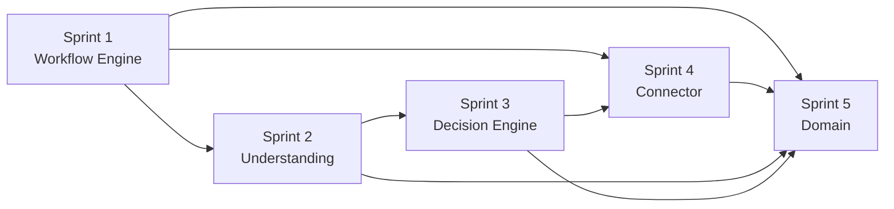

# Architecture Alignment Plan

| | |
|---|---|
| **Purpose** | 定義現有實作如何漸進對齊文件架構（5 個 sprint） |
| **Audience** | 架構師、維護者 |
| **Source of truth** | 本文件是**架構對齊實施計畫**的權威來源 |
| **Related** | [03-evolution-roadmap.md](03-evolution-roadmap.md)、[04-module-map.md](04-module-map.md) |

> **目的：** 定義本 repository 如何從現有可運作實作，漸進演進為 [Enterprise AI Agent Reference](02-reference-architecture.md)。  
> **原則：** 不追求速度；追求架構清晰度。每次 sprint 只引入**一個**架構概念。  
> **前提：** Phase 1（架構理解）已完成 — 見 [04-module-map.md](04-module-map.md)、[05-vocabulary.md](05-vocabulary.md) 與架構 gap analysis。

---

## 計畫總覽

本計畫包含 **5 個 implementation sprint**，對應 [03-evolution-roadmap.md](03-evolution-roadmap.md) 的 Phase 2–4。Phase 5（Workshop Experience）不在此計畫內，將在各 sprint 完成後獨立規劃。

```
Sprint 1 ──► Workflow Engine 邊界
Sprint 2 ──► Understanding 邊界
Sprint 3 ──► Decision Engine
Sprint 4 ──► Connector 抽象
Sprint 5 ──► Domain 分離
```

每個 sprint 結束時：

- `make test` 通過
- `make dry-run` 可執行（若環境允許）
- 行為與 sprint 前一致（除非 sprint 明確引入可觀察的決策記錄改善）
- 無需長期 unstable branch

---

## 不在此計畫內的事項

以下刻意排除，避免 scope creep：

| 排除項目 | 理由 |
|----------|------|
| 替換 LangGraph 或其他框架 | 無架構必要性；違反 Preserve before Replace |
| 全面改為 event push（取代 poll） | 屬 Connector 實作細節演進，非獨立 sprint 目標 |
| 新增 Jira / ServiceNow connector | Phase 4 之後的擴充，需 Sprint 4 介面先就位 |
| 統一 Risk / Confidence 評分模型 | 依賴 Decision Engine 穩定後再迭代 |
| Response 獨立 sprint | 隨 Sprint 3（決策解釋）與 Sprint 5（領域回覆邏輯）逐步改善 |
| Tool Provider 重寫 | 現有 MCP 抽象已足夠；Sprint 4 僅釐清與 Connector 的邊界 |

---

## Sprint 1：Workflow Engine 邊界

### Goal

建立清晰的 **Workflow Engine** 邊界：`main.py` 只負責應用啟動與生命週期；workflow 編排與單次處理迴圈移入專責模組。

### Why this sprint exists

目前 `main.py` 同時扮演 Connector 觸發、pre-workflow triage、workflow 啟動、memory 管理與報告 — 這是新人與貢獻者最大的困惑來源。在引入其他架構概念前，必須先有一個可指認的「編排層」。

### Related design principles

- **Workflow over Conversation** — workflow 是產品，需要可見的編排邊界
- **Extensible by Design** — Workflow Engine 應可替換，不與入口耦合
- **Preserve before Replace** — 保留現有 LangGraph graph，僅移動呼叫關係

### Expected architectural improvement

- `main.py` 變薄：CLI、設定載入、啟動 poll loop
- 新增 runtime 模組（例如 `runtime/` 或 `workflow/runner.py`）負責單次 poll 週期的編排
- `workflow/graph.py` 職責更單純：定義狀態機，不含 poll / memory 持久化
- [04-module-map.md](04-module-map.md) 中「Workflow Engine」列可一對一指向模組

### Expected risks

| 風險 | 緩解 |
|------|------|
| 移動 `main.py` 邏輯時引入 subtle 行為差異 | 完整跑 `make test`；關鍵路徑加整合測試 |
| 新模組命名與目錄引發第二輪重構 | Sprint 1 只做「搬家」，不改 graph 節點邏輯 |
| `memory` 讀寫時機改變 | 保持 save/load 呼叫點與現況等價 |

### Estimated implementation complexity

**Medium**

### Files or modules likely to be affected

| 區域 | 檔案 |
|------|------|
| 入口 | `main.py` |
| 新增 | `runtime/` 或 `workflow/runner.py`（擇一，不兩者並存） |
| 可能微調 | `workflow/graph.py`（僅 deps 注入方式） |
| 測試 | `tests/test_workflow_integration.py`、新增 runner 測試 |

### Why this sprint should happen before the next one

Understanding、Decision Engine、Connector 都需要一個穩定的「誰負責編排」的答案。在編排邊界模糊時重構 Understanding，只會把 triage 邏輯移到另一個錯誤的位置。

---

## Sprint 2：Understanding 邊界

### Goal

建立清晰的 **Understanding** 邊界：所有「解讀外部輸入」的語意產出，經由單一入口；確定性 routing（shell、cluster、upload 推斷）從語意理解中分離。

### Why this sprint exists

理解職責目前跨 `main.py`（或 Sprint 1 的 runner）、`comment_analyzer` 與 workflow `analyze` 節點。`comment_analyzer` 同時做 LLM triage 與 action routing，違反 [05-vocabulary.md](05-vocabulary.md) 中 Understanding「不執行工具、不做業務決策」的定義。

### Related design principles

- **Governance over Intelligence** — 理解產出結構化結果，決策留給 Decision Engine
- **Policy over Prompt** — routing heuristics 是確定性邏輯，不應與 LLM prompt 混雜
- **Workflow over Conversation** — 理解是 workflow 的一步，需有明確輸入輸出契約

### Expected architectural improvement

- 新增 `understanding/` 或 `core/understanding/` 套件，含：
  - **Semantic understanding** — LLM triage、interpretation、collaboration reasoning
  - **Action inference**（暫名）— 確定性 routing：`shell_diagnostics`、`cluster_read_routing`、`collection_flow` 推斷
- 單一 `UnderstandingService`（或等價入口）產出 `CommentAnalysis` 或等價結構
- Workflow `analyze` 節點與 poll runner 皆呼叫同一入口，消除 `analysis_prefilled` 雙路徑的必要性（可保留為過渡）
- `participants`、`trigger` 維持在 Understanding 前置閘門，不併入 Decision Engine

### Expected risks

| 風險 | 緩解 |
|------|------|
| 拆分 `comment_analyzer` 破壞既有 triage 行為 | 先提取、後刪除；每步 `make test` |
| routing 與 understanding 的邊界爭議 | 以詞彙表為準：routing 產出「建議動作」，不產出「是否允許」 |
| 測試覆蓋不足 | 現有 `test_workflow_analyze.py` 等測試遷移後仍通過 |

### Estimated implementation complexity

**Medium–High**（檔案移動多，但邏輯不變）

### Files or modules likely to be affected

| 區域 | 檔案 |
|------|------|
| 核心 | `core/comment_analyzer.py`（拆分） |
| 路由 | `core/shell_diagnostics.py`、`core/cluster_read_routing.py`、`core/collection_flow.py`（移入 inference 層） |
| 理解 | `core/result_interpreter.py`、`core/collaboration_reasoner.py`、`core/case_convergence.py` |
| 編排 | Sprint 1 的 runner、`workflow/graph.py` `analyze` 節點 |
| 測試 | `tests/test_workflow_analyze.py`、`tests/test_investigation.py` |

### Why this sprint should happen before the next one

Decision Engine 需要明確的輸入：「理解了什麼」與「建議做什麼」。若 Understanding 邊界仍模糊，Decision Engine 會被迫包含理解邏輯，重蹈現有 `comment_analyzer` 的覆轍。

---

## Sprint 3：Decision Engine

### Goal

引入 **Decision Engine** 作為一等架構元件：集中政策評估、核准閘門與決策記錄；workflow 的 `policy` 節點改為呼叫 Decision Engine，而非直接呼叫 `mcp_policy` 與 `approval`。

### Why this sprint exists

治理邏輯已存在（`policy_compiler`、`mcp_policy`、`approval`），但分散且無統一決策入口。這是文件架構與實作之間最大的結構性缺口，也是 **Trust before Autonomy** 的技術核心。

### Related design principles

- **Policy over Prompt** — 決策邏輯集中、可審計
- **Human by Exception** — 核准判斷由 Decision Engine 統一輸出
- **Governance over Intelligence** — 「能不能做」不由 LLM 決定
- **Trust before Autonomy** — 每條路徑能回答「為何允許或拒絕」

### Expected architectural improvement

- 新增 `core/decision_engine.py`（或 `decision/` 套件），對外提供：
  - `evaluate(actions, context) → DecisionResult`（允許 / 拒絕 / 需核准 / 需升級）
  - 內部委派至現有 `mcp_policy`、`approval`（**搬家，不重寫**）
- `DecisionResult` 含：`allowed`、`reason`、`policy_ref`、`requires_approval`、`risk_hint`
- Audit trail 記錄決策結果，不再僅記錄執行結果
- Response 可選擇性帶入 `DecisionResult.reason`（最小改動，不獨立開 Response sprint）
- [04-module-map.md](04-module-map.md) 中 Decision Engine 列可一對一指向模組

### Expected risks

| 風險 | 緩解 |
|------|------|
| 抽象層過度設計 | Sprint 3 僅做 facade + 資料結構，不重寫 policy 規則 |
| 決策與 guardrail 混淆 | Guardrail（grounding、出站掃描）留在 Response 路徑；Decision Engine 只管組織規則 |
| 行為回歸 | `tests/test_policy_compiler.py`、`tests/test_workflow_approval.py`、`tests/test_guardrails.py` 全過 |

### Estimated implementation complexity

**Medium**

### Files or modules likely to be affected

| 區域 | 檔案 |
|------|------|
| 新增 | `core/decision_engine.py`（或 `decision/`） |
| 既有（委派） | `core/mcp_policy.py`、`core/approval.py`、`core/policy_compiler.py` |
| 編排 | `workflow/graph.py` `policy` 節點 |
| 審計 | `core/audit_trail.py` |
| 測試 | `tests/test_workflow_approval.py`、`tests/test_policy_compiler.py` |

### Why this sprint should happen before the next one

Connector 抽象會引入新的事件來源與回應通道。若 Decision Engine 尚未統一，每個 Connector 可能各自實作政策檢查，破壞 **Product Agnostic** 與可審計性。

---

## Sprint 4：Connector 抽象

### Goal

引入 **Connector** 介面：`CasePortalBridge` 成為第一個實作；poll 迴圈改為透過 Connector 取得事件，而非在 runtime 中直接呼叫 Portal API。

### Why this sprint exists

Reference Architecture 要求 Agent 與產品無關。目前 Case 讀寫、留言解析、輪詢邏輯與 `main.py` / runner 耦合，無法在不改核心的情况下新增 Jira 或 ServiceNow。

### Related design principles

- **Product Agnostic** — 產品是 Integration，不是架構
- **Extensible by Design** — Connector 可替換
- **Event-driven Workflow** — poll 是 Connector 的一種事件取得策略，不是 Workflow Engine 的職責

### Expected architectural improvement

- 新增 `connectors/` 或 `bridges/connectors/` 含：
  - `Connector` 抽象介面：`poll_events()` / `fetch_context()` / `send_response()`
  - `CasePortalConnector` — 從現有 `case_portal.py` + `comments.py` + `case_api_models.py` 演進
- Sprint 1 的 runner 依賴 `Connector` 介面，不依賴 Red Hat 專屬型別
- `bridges/mcp_registry` 與 Tool Provider **維持不變**；僅釐清 Connector（營運系統對話）vs Tool Provider（操作執行）邊界
- Poll 間隔、cooldown 等仍由 runtime 管理；Connector 只負責「有什麼新事件」

### Expected risks

| 風險 | 緩解 |
|------|------|
| 過早泛化介面 | 介面只涵蓋 Case Agent 已用到的操作，不預測 Jira API |
| `case_portal` 與 MCP 的雙重依賴 | Case 讀寫仍經 MCP 是實作細節，封裝在 Connector 內 |
| 輪詢行為改變 | 介面後的第一個實作必須與現有 poll 語意等價 |

### Estimated implementation complexity

**Medium–High**

### Files or modules likely to be affected

| 區域 | 檔案 |
|------|------|
| 新增 | `connectors/base.py`、`connectors/case_portal.py` |
| 演進 | `bridges/case_portal.py`、`core/comments.py`、`core/case_api_models.py` |
| 編排 | Sprint 1 runner、`main.py` |
| 不變 | `bridges/mcp_registry.py`、`core/mcp_action.py` |
| 測試 | `tests/test_case_api_models.py`、新增 connector 契約測試 |

### Why this sprint should happen before the next one

Domain 分離（Sprint 5）需要知道「哪些是 Connector 的責任、哪些是 Domain workflow 的責任」。先建立 Connector 邊界，才能乾淨地把 Case 專屬邏輯移入 Domain 層。

---

## Sprint 5：Domain 分離

### Goal

建立 **Domain** 層：將 Case Agent 專屬的業務流程步驟從通用 Workflow Engine 中抽出，使 `workflow/graph.py` 成為可重用的編排骨架。

### Why this sprint exists

`collection_flow`、`diag_bundle`、`investigation` 等是 Reference Implementation 的領域價值，但不是 Enterprise Agent 通用核心。它們目前在 `graph.py` 中觸發，使 Workflow Engine 看起來與 Support Case 不可分割。

### Related design principles

- **Product Agnostic** — 架構獨立，Domain 可替換
- **Reference Implementation vs Reference Architecture** — 藍圖不變，僅整理範例的領域邏輯
- **Workflow over Conversation** — Domain 定義「這個 workflow 做什麼」；Engine 定義「怎麼編排」

### Expected architectural improvement

- 新增 `domain/case/`（或 `workflows/case/`）含：
  - `collection_flow`、`diag_bundle`、`investigation` 的 **編排掛鉤**（hooks 或 step registry）
  - Case 專屬的 convergence、clarify 模板邏輯
- `workflow/graph.py` 透過注入的 Domain hooks 呼叫領域步驟，不再直接 import 領域模組
- 通用元件（Understanding、Decision Engine、Tool Provider、Response、Connector）與 Domain 無 import 依賴
- 未來 Jira Agent 可新增 `domain/jira/` 而不修改 graph 骨架

### Expected risks

| 風險 | 緩解 |
|------|------|
| Hook 抽象過早 | 僅抽取 graph 中已存在的三個領域步驟，不設計通用 DSL |
| 雙重間接層增加閱讀成本 | 以 [04-module-map.md](04-module-map.md) 更新對照；Domain 目錄自解釋 |
| investigate loop 行為回歸 | `tests/test_collection_flow.py`、`tests/test_diag_bundle.py`、`tests/test_investigation.py` 全過 |

### Estimated implementation complexity

**High**（觸及 workflow 核心，但邏輯不變）

### Files or modules likely to be affected

| 區域 | 檔案 |
|------|------|
| 新增 | `domain/case/` 套件 |
| 移動 | `core/collection_flow.py`、`core/diag_bundle.py`、`core/investigation.py` |
| 編排 | `workflow/graph.py` |
| 可能移動 | `core/case_convergence.py`、`config/clarify_templates.yaml` 參照 |
| 測試 | `tests/test_collection_flow.py`、`tests/test_diag_bundle.py`、`tests/test_investigation.py`、`tests/test_workflow_integration.py` |

### Why this sprint is last

Domain 分離是架構清晰度的高點，但風險最高、依賴最多。必須在 Workflow Engine、Understanding、Decision Engine、Connector 邊界都就位後進行，否則領域邏輯會被抽到錯誤的抽象層。

---

## Sprint 依賴關係



Sprint 1 是所有後續工作的前置。Sprint 2 與 Sprint 3 有順序要求。Sprint 4 可在 Sprint 3 完成後開始。Sprint 5 必須最後。

---

## 各 Sprint 完成後的驗證清單

每個 sprint 結束時，執行者應確認：

- [ ] `make test` 通過
- [ ] `make policy-dump` 輸出與 sprint 前一致（Sprint 3 前）
- [ ] `make dry-run` 可執行（若環境具備 `.env`）
- [ ] [04-module-map.md](04-module-map.md) 已更新對應章節
- [ ] [PROGRESS.md](../PROGRESS.md) 已記錄 sprint 完成與已知問題
- [ ] 無新增 framework 依賴
- [ ] 行為變更（若有）已在 sprint 說明中記錄

---

## 成功指標

本計畫成功時，repository 應呈現以下狀態：

| 架構概念 | Sprint 完成後的狀態 |
|----------|---------------------|
| Workflow Engine | 可指認的編排模組；`main.py` 不再承載業務迴圈 |
| Understanding | 單一入口；語意與 routing 分離 |
| Decision Engine | 獨立元件；決策可審計、可解釋 |
| Connector | 介面 + Case 實作；poll 不綁定 Portal |
| Domain | Case 專屬邏輯隔離；graph 可重用 |
| Tool Provider | 維持現狀，邊界在 Sprint 4 釐清 |
| Response | 隨 Decision Engine 與 Domain 分離逐步改善 |

最終衡量標準與 [03-evolution-roadmap.md](03-evolution-roadmap.md) 一致：

> 未來貢獻者比過去更快理解架構；repository 更容易學習、擴充與信任。

---

## Sprint 完成後的下一步（Phase 5 預覽）

5 個 sprint 完成後，建議進入 Workshop Experience 階段，**不引入新架構概念**：

- 更新 [docs/README.md](../README.md) 文件索引
- 新增 demo scenario 與設定範例
- 撰寫「從 Case Agent 複製出 Jira Agent」教學骨架（文件 only，可不實作）
- 檢視 config 結構是否利於 workshop 敘事

此階段獨立規劃，不在本 alignment plan 範圍內。

---

## 延伸閱讀

| 文件 | 用途 |
|------|------|
| [03-evolution-roadmap.md](03-evolution-roadmap.md) | 演進原則與 Phase 定義 |
| [04-module-map.md](04-module-map.md) | 現況模組責任 |
| [05-vocabulary.md](05-vocabulary.md) | 架構語言定義 |
| [02-reference-architecture.md](02-reference-architecture.md) | 目標架構 |
| [docs/.ai/definition-of-done.md](../.ai/definition-of-done.md) | 變更完成標準 |
