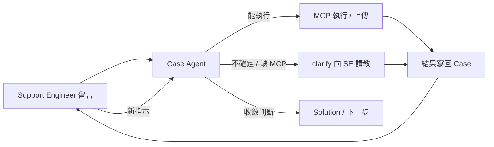

# Case Agent — 價值核心

> 對外簡報見 [docs/PITCH.md](docs/PITCH.md)

## 一句話

**Case Agent = 企業營運團隊在 Outage / Support Case 上，與 Red Hat Support Engineer 協作排查、收斂問題、尋找 Solution 的代理助手。**

不是 IDE 裡的 coding agent，也不是「掛滿 MCP 才能跑的自動化腳本」。

**對外三關鍵字**：Case-native · Guardrail-first · Vendor 協作

---

## 核心價值主張

| 維度 | 說明 |
|------|------|
| **協作對象** | 人類 SRE / 營運人員 + Red Hat Support Engineer（透過 Case 留言） |
| **典型場景** | Outage 發生 → SE 要求執行診斷、上傳 log / 設定檔 → Agent 代勞並回覆 → 持續互動直到收斂 |
| **企業前提** | 在**有 Guardrail** 的前提下才允許 Agent 碰環境；沒有 guardrail 的自主執行在 Enterprise 不可接受 |
| **泛用性** | 不綁單一產品（非 RHEL-only / OCP-only / Ansible-only）；能力靠 **MCP 掛載**擴充 |
| **定位** | 營運團隊的小幫手：跟原廠工程師一起協作，縮小問題範圍，不是取代人 |

### 協作閉環（成功路徑）



**關鍵心智模型**：協作縮小問題直到收斂 = 成功路徑，不是「沒 MCP 就失敗」。

---

## PoC 成功標準（不要以「自動結案」當 KPI）

| 指標 | 說明 | 量測方式（示例） |
|------|------|-----------------|
| **回應時效** | SE 第一輪診斷要求後，多久有結構化回覆 | 留言時間戳 → Agent 回覆時間戳 |
| **來回次數** | SE↔客戶來回是否減少 | Case 留言數 / 同一診斷項重複次數 |
| **漏跑率** | 人為漏跑 / 漏傳診斷是否下降 | 對照 PoC 前後 SE 追問「請再跑一次」比例 |
| **安全攔截可理解** | 危險指令被擋時，SE 能否理解並給替代步驟 | 被擋留言後 SE 是否提供替代指令（定性） |
| **clarify 有效率** | 不確定時主動請教，後續能繼續執行 | clarify → SE 補充 → 成功執行 的比例 |

**PoC 通過 ≠ 全自動結案**；通過 = 證明「受控協作」能縮短排查時間、降低人為疏失。

---

## 與 Cursor 等工具的差異（不必對標）

| | Case Agent | Cursor / 通用 Coding Agent |
|--|------------|------------------------------|
| **工作介面** | Red Hat Support Case（留言、附件） | IDE、終端機、本機 repo |
| **協作對象** | 原廠 Support Engineer | 開發者自己 |
| **主要任務** | 診斷、收集證據、依 SE 指示 troubleshooting | 寫 code、重構、debug 程式 |
| **安全模型** | 多層 Guardrail + policy.yaml 能力包 + 審計 | 使用者自行承擔本機權限 |
| **執行邊界** | 確定性規則決定「能不能跑」；LLM 只做語意 | LLM 常直接驅動 tool call |
| **產出** | 結構化 Case 回覆（可防偽、可稽核） | Patch、commit、chat 回覆 |

**結論**：Case Agent 解的是 **Enterprise Support 協作 + 受控執行**。兩者場景不同，不必互相取代。

---

## 主要能力路徑

### 多數 Support 留言

- 請執行指令 / `oc get` / `dig` → 能跑就跑 → **結果寫回 Case 留言**
- 危險指令 → 擋下並說明；其餘能執行的照常跑（`skip_and_continue`）

### 沒有對應 MCP 時（一樣是正常解法）

- sosreport、must-gather、產品專用收集 → **沒有 MCP 也沒關係**
- Agent 用 `clarify` / 回覆 **向 Support 請教**：在哪台機器、完整指令、產物路徑、是否上傳附件
- Support 給出明確步驟後 → 再執行或再上傳

### 附件

- 預設：輸出在 **留言**
- 可選 `bundle_output.mode: overflow_only` → 僅當輸出過長才 spill 成附件
- 明確上傳某檔案 → 由 LLM 規劃 `upload_attachment_rh_portal`（或日後產品 MCP）

### 架構分工：Agent 薄、MCP 厚

- **Agent**：觸發、policy、workflow、Case 讀寫、回覆防偽
- **MCP**：實際執行（可多 provider，依環境掛載）
- **不**在 Agent 內列舉檔名關鍵字或堆產品 playbook

---

## LLM 只做語意，不做閘門

| LLM 負責 | 確定性規則負責 |
|----------|----------------|
| 理解留言意圖、選 MCP 工具 | 是否觸發、身份辨識 |
| 撰寫回覆、解讀結果、判斷收斂 | 安全放行（policy / guardrail） |
| 環境不確定時向 SE 提出具體問題 | 危險指令攔截、回覆防偽 |

---

## 五層 Guardrail（Enterprise 必備）

```
┌─────────────────────────────────────────────────────────────┐
│ L0 觸發規則：誰的留言、是否該處理                             │
├─────────────────────────────────────────────────────────────┤
│ L1 危險關鍵字（留言 + 出站）                                 │
├─────────────────────────────────────────────────────────────┤
│ L2 policy.yaml 能力包                                       │
├─────────────────────────────────────────────────────────────┤
│ L3 確定性路由：純網路診斷 shell → exec；oc get → API 工具     │
│    無法映射 → clarify（含向 SE 請教怎麼做）                  │
├─────────────────────────────────────────────────────────────┤
│ L4 Exec MCP：argv 陣列                                       │
├─────────────────────────────────────────────────────────────┤
│ L5 回覆防偽                                                  │
└─────────────────────────────────────────────────────────────┘
```

Agent 負責 L0～L3、L5；MCP 負責 L4。SE 透過 Case 交流補齊 L3 裡「不知道怎麼做」的部分。

**Enterprise 敘事**：客戶敢讓 Agent 碰環境，是因為有邊界，不是因為它很聰明。

---

## Roadmap：Phase 1 PoC → Phase 2 Enterprise

### Phase 1 — PoC（證明「受控協作」可行）

**目標**：在 1～2 個真實 Case 上，證明能縮短 SE↔客戶來回、降低漏跑診斷。

| 優先項 | 內容 | 狀態 |
|--------|------|------|
| Case 讀寫 + 輪詢 | 讀 SE 留言、結構化回覆 | ✅ 已有 |
| 診斷執行 | `oc get`、Pod log、dig/ping（MCP） | ✅ 已有 |
| 五層 Guardrail | policy profile、危險指令攔截、回覆防偽 | ✅ 已有 |
| clarify 路徑 | 不確定 / 缺 MCP 時向 SE 請教 | ✅ 已有 |
| dry-run | 上線前試跑、不發回覆 | ✅ 已有 |
| **SRE 可見性（最小版）** | run log / dry-run 報告：做了什麼、擋了什麼 | ✅ `--report` + `reports/{case_id}/` |
| **上傳閉環** | must-gather / 指定檔案 → 上傳 → 回覆確認 | ✅ collection_node + 附件清單驗證 |
| **PoC 量測** | 回應時效、來回次數、漏跑率 baseline | ✅ `metrics.json` + `--report` |

**Phase 1 刻意不做**：多租戶、PagerDuty 整合、全產品 MCP 生態。

---

### Phase 2 — Enterprise（敢上 Production）

**目標**：資安 / 管理層可稽核、可治理；Outage 時可信任運維。

| 優先項 | 內容 | 狀態 |
|--------|------|------|
| **稽核 trail** | 每次 tool call / policy / 回覆 → `audit.jsonl` | ✅ |
| **Enterprise profile 預設** | `enterprise` + `allowlist` + 範例設定 | ✅ |
| **Secrets 管理** | `secrets.env_from_files`（Vault/K8s Secret） | ✅ |
| **Outage 模式** | 縮短輪詢 + webhook 通知 | ✅ |
| **人工核准關卡** | `--approve` / `approvals.json` | ✅ |
| **Case 上下文記憶** | `diagnostics_history` 避免重複診斷 | ✅ |
| **多產品 MCP 生態** | 範例 + `docs/MCP_PROVIDERS.md` | ✅ |
| **非 OCP 環境** | RHEL exec 範例 + SSH 契約 | ✅ |
| **可觀測性** | `--health` / `--health-json` | ✅ |
| **RBAC / 多租戶** | `tenant.id` + 一團隊一實例 | ✅ |

詳細部署：[docs/ENTERPRISE.md](docs/ENTERPRISE.md)

---

### 擴充方向（跨 Phase）

1. **多 MCP 掛載**：platform + exec + 產品專用 → 能力疊加，Agent 本體不膨脹
2. **泛用 Case Agent**：新產品 = 新 MCP + capability map 條目，不改 workflow 核心
3. **clarify 模板庫**：各產品「向 SE 要什麼資訊」的標準問法（`config/clarify_templates.yaml`）— ✅ 已落地

---

## 設計原則（不要走窄）

- **協作 > 全自動**：clarify 與 SE 互動是功能，不是 fallback
- **Guardrail 是賣點，不是限制**：Enterprise 買的是「敢讓它碰環境」
- **Agent 薄、MCP 厚**：執行能力外掛，安全與 workflow 內建
- **PoC 證明價值，Enterprise 證明可信**
- **ReAct，不是傳聲筒**：核心價值是 **Reason → Act → Observe → 再 Reason**，不是把 SE 指令原樣執行後貼回 output

---

## 核心心智模型：Guardrailed ReAct

Case Agent 的目標形態，對齊 LangGraph / Agent 社群的 **ReAct**（Reasoning + Acting），但加上 Enterprise 必備的 **Guardrail 閘門**——可稱 **Guardrailed ReAct**。

### 什麼是 ReAct（我們要的）

```
Thought  → 理解 SE 留言、Case 脈絡、先前診斷
Action   → 透過 MCP 執行（或 clarify / 請教）
Observe  → 讀取 MCP 輸出、附件、Case 狀態
Thought  → 綜合觀察、形成假設、決定下一步要查什麼
Action   → （同一輪內）再跑診斷，或向 SE 提出具體問題
…        → 直到有足夠證據再寫回 Case
Reply    → 帶**判斷與建議**的回覆，不是 raw log dump
```

**小幫手的價值**在於：跟 SE **一起縮小問題**——提出觀察、呼應 SE 假設、主動補查、不確定時請教。  
**傳聲筒**只做：SE 說跑 X → 跑 X → 貼 X。這不是產品目標。

### 現況 vs 目標

| 層次 | 現況（Phase 1–2） | 目標 |
|------|-------------------|------|
| **跨輪 ReAct** | ✅ 有：每輪 poll 讀 SE → analyze → 執行 → 回覆 → 等 SE | 維持；累積 `diagnostics_history` / case memory |
| **單輪內 ReAct** | ⚠️ 弱：analyze **一次**定好 MCP → execute **一次** → interpret → compose | **investigate loop**：observe 後可再 reason → 再 act（有步數上限） |
| **Reason 深度** | analyze / interpret / convergence / compose **四次分開 LLM** | 收斂成連貫推理鏈；compose 必須**綜合**而非轉述 |
| **Act 邊界** | ✅ policy / approval / grounding 每步檢查 | 維持；**LLM 不決定能不能跑** |

目前 workflow 較接近 **Plan → Execute → Report** 單次管線：

```
analyze → policy → execute → interpret → convergence → compose → post
```

這在 PoC 夠用，但若長期停在這裡，體感會像「自動化執行器 + 模板回覆」，不是協作小幫手。

### Guardrailed ReAct 分工（不變的邊界）

| ReAct 環節 | 誰做 | Guardrail |
|------------|------|-----------|
| **Reason** | LLM（analyze / interpret / 未來 investigate） | 不捏造 cluster 狀態 |
| **Act** | MCP（經 policy 放行） | L2–L4 policy、approval、audit |
| **Observe** | 結構化 state（execution_results、附件驗證） | 真實 MCP 輸出 |
| **Reply** | LLM compose | L5 grounding + guardrail |

> **LLM 做語意與推理；確定性規則做閘門。** 兩者不衝突——ReAct 是「怎麼想、怎麼查」；Guardrail 是「能不能查、能不能說」。

### 反模式（不要走窄）

| ❌ 傳聲筒 | ✅ Guardrailed ReAct |
|----------|---------------------|
| SE 要 `oc get pod` → 只貼 pod list | 貼 list + 指出異常 pod + 呼應 SE 假設 |
| interpret 與 compose 脫節，compose 重述 output | 同一推理鏈產出「發現 + 建議 + 問題」 |
| 缺 MCP 就失敗 | clarify 是**主動排查策略**，不是 fallback |
| 固定模板句（「已代為執行…」） | 自然協作語氣，事實仍 grounding |
| 一輪只能 act 一次 | 同一 SE 留言下可**多步 observe→act**（有上限） |

### Roadmap：Phase 3 — Agentic Investigate Loop

| 項目 | 說明 | 狀態 |
|------|------|------|
| **investigate 節點** | interpret 後 LLM 可選「再查」→ policy → execute → 回到 interpret | ✅ `investigate_prepare` + conditional edges |
| **步數 / 成本上限** | `investigation.max_follow_up_steps`（預設 2） | ✅ |
| **follow_up MCP 規劃** | interpret 輸出 `follow_up_mcp_calls`，經 catalog 過濾 | ✅ |
| **compose 合流** | interpret + compose 合併或共享 reasoning trace | 🔲 可選優化 |
| **prompt 小幫手 persona** | 綜合、假設、請教——非 relay | ✅ compose_reply 已強化 |

LangGraph 流程：

```
execute → interpret ⇄ investigate_prepare → policy → execute → … → collection → bundle → convergence → compose → post
```

設定範例（`config/agent_config.json`）：

```json
"investigation": {
  "enabled": true,
  "max_follow_up_steps": 2
}
```

`max_follow_up_steps` = 第一輪 execute→interpret **之後**，最多再跑幾次 follow-up execute（不含 SE 最初 analyze 規劃的那批）。


